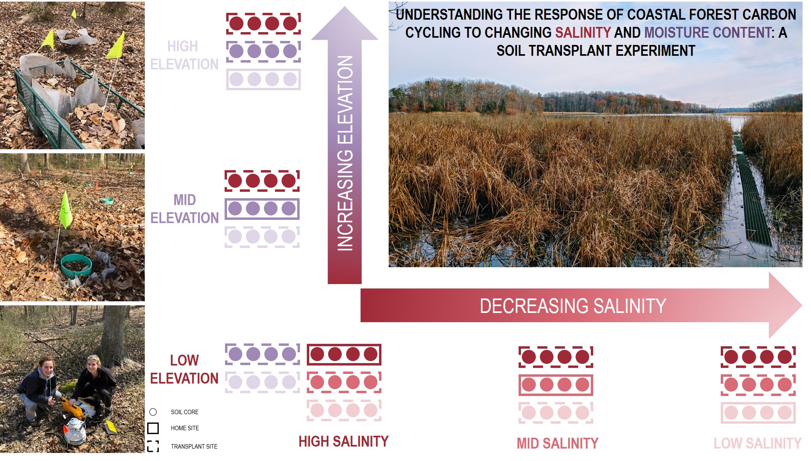

```{r setup, include=FALSE}
knitr::opts_chunk$set(echo = TRUE)

library(ggplot2)
theme_set(theme_bw())
library(readr)
```

**Project Overview:** Coastal terrestrial-aquatic interface (TAI) ecosystems exhibit particular sensitivity to changes in climate and sea level, but the response of soil carbon cycling to changing salinity and water availability remains poorly understood. As a part of a broader COMPASS Program effort to understand coastal ecosystem resilience and responses to future change, this experiment took advantage of natural salinity and elevation gradients at the Smithsonian Environmental Research Center (SERC) in eastern Maryland, USA, to examine how soil processes and structure may change under novel hydrologic regimes. 

**Research Questions:** 

-  How do coastal TAI soil respiration rates respond to changing salinity and water availability? 
-  Are coastal TAI soil respiration rate responses regulated by physicochemical properties? 
-  Are these responses depth-specific?

**Experimental Design:** Large (40 cm wide x 20 cm deep) soil cores were transplanted in a reciprocal design between plots varying in seawater exposure and elevation above the creek (Figure 1); we continuously monitored soil respiration rates for two years and analyzed physicochemical properties at multiple core depth increments (0-5, 5-10, and 10-20 cm) following this measurement period.


**Figure 1.** Reciprocal design of the soil transplant experiment.

**Preliminary Data Analysis:** We have measured 18 physicochemical variables. We can break our soil chemical properties into the below categories:

-  Fertility indicators: Base Saturation (%), Cation Exchange Capacity (meq/100g), pH
-  Carbon and major nutrient: Total C (%), Total N (%), Phosphorus (mg/kg), Potassium (mg/kg)
-  Secondary nutrients: Calcium (mg/kg), Magnesium (mg/kg)
-  Minor nutrients: Iron (mg/kg), Manganese (mg/kg), Copper (mg/kg), Zinc (mg/kg), Molybdenum (mg/kg)
-  Reactive alkali metals: Sodium (mg/kg), Potassium (mg/kg) 
-  Contaminants: Cadmium (mg/kg), Copper (mg/kg), Lead (mg/kg), and Zinc (mg/kg)

Some are in two categories above and others that are of minor interest have not been listed yet. Still thinking about these groupings...might change things around.

In the following section, we will explore the effect of increasing **salinity** on soil chemical properties. Investigations will be grouped using the above categories and will include the following visualizations:

-  Control core depth profiles across the salinity gradient
-  Low salinity transplant cores (1) across the salinity gradient and (2) at home site
-  Mid salinity transplant cores (1) across the salinity gradient and (2) at home site
-  High salinity transplant cores (1) across the salinity gradient and (2) at home site
-  Thinking about an overall figure...but am worried it will be very overwhelming and difficult to interpret

I started by visualizing all of the control data. Going to use Base Saturataion as an example of the above process.

**FERTILITY INDICATORS**

```{r data-file examination, results = 'hide'}
#Does resuts=FALSE keep it from showing up in the R Markdown file?

#EXAMINE DATA FRAME STRUCTURE
#Read in physicochemical data
phys_data <- read_csv("Data/TransplantExp_PhysicoData_All_02242021_v2.csv") #Need to specify columns? Either c = categorical or d=? something numeric?

#Examine data file
summary(phys_data)
str(phys_data)

#Assigning variable levels for graphing purposes.
phys_data$Home_Salinity = factor(phys_data$Home_Salinity, levels=c("Low", "Mid", "High"))

#Data file looks good. 204 samples. 8 missing from C&N analysis due to instrument issue. Cd, Cr, CU, and Mo reporting as character due to UGA "<" designations. Need to come back to those variables. 
```


```{r data-file manipulation}
#MANIPULATE DATA FRAMES

#1. Control core depth profiles across the salinity gradient
#Isolating control cores from salinity transect
sal_con <- subset(phys_data, Transect_Type == "S" & Treatment == "Control")

#Calculating mean with site and depth for all variables
mean_con <- aggregate(x = sal_con[c("TotalN", "TotalC", "LBC", "LBCeq", "pH", "BaseSat", "CEC", "Ca", "Fe", "K", "Mg", "Mn", "Na", "Ni", "P", "Pb", "Zn")],
                      by = sal_con[c("Home_Salinity", "Depth")],
                      FUN = mean)

#2. Low salinity transplant cores (1) across the salinity gradient and (2) at home site 
#Isolating low salinity cores - control and transplant
sal_low <- subset(phys_data, Transect_Type == "S" & Home_Salinity == "Low")
sal_low$Local_Salinity <- c("High","High","High","High","High","High","High","High","High","High","High","High","Mid","Mid","Mid","Mid","Mid","Mid","Mid","Mid","Mid","Mid","Mid","Mid","Low","Low","Low","Low","Low","Low","Low","Low","Low","Low","Low","Low")

#Assigning variable levels for graphing purposes.
sal_low$Local_Salinity = factor(sal_low$Local_Salinity, levels=c("Low", "Mid", "High"))

mean_low <- aggregate(x = sal_low[c("TotalN", "TotalC", "LBC", "LBCeq", "pH", "BaseSat", "CEC", "Ca", "Fe", "K", "Mg", "Mn", "Na", "Ni", "P", "Pb", "Zn")],
                      by = sal_low[c("Depth", "Local_Salinity", "Treatment")],
                      FUN = mean)

#Isolating low salinity transplant cores from salinity transect
sal_lowtrans <- subset(phys_data, Transect_Type == "S" & Treatment == "Transplant" & Home_Salinity == "Low")

#Add a "local salinity" column to group with control data
sal_lowtrans$Local_Salinity <- sal_lowtrans$Transplant_Salinity
sal_con$Local_Salinity <- sal_con$Home_Salinity

#Merging dataframes
sal_lowcon <- rbind(sal_con, sal_lowtrans)

#Calculating mean with site and depth for all variables
mean_lowtrans <- aggregate(x = sal_lowtrans[c("TotalN", "TotalC", "LBC", "LBCeq", "pH", "BaseSat", "CEC", "Ca", "Fe", "K", "Mg", "Mn", "Na", "Ni", "P", "Pb", "Zn")],
                      by = sal_lowtrans[c("Home_Salinity", "Depth", "Local_Salinity", "Treatment")],
                      FUN = mean)

mean_con <- aggregate(x = sal_con[c("TotalN", "TotalC", "LBC", "LBCeq", "pH", "BaseSat", "CEC", "Ca", "Fe", "K", "Mg", "Mn", "Na", "Ni", "P", "Pb", "Zn")],
                      by = sal_con[c("Home_Salinity", "Depth", "Local_Salinity", "Treatment")],
                      FUN = mean)

#Mergrin dataframes
ave_sal_lowcon <- rbind(mean_con, mean_lowtrans)

#3. Mid salinity transplant cores (1) across the salinity gradient and (2) at home site
#Isolating MID salinity cores - control and transplant
sal_mid <- subset(phys_data, Transect_Type == "S" & Home_Salinity == "Mid")
sal_mid$Local_Salinity <- c("High","High","High","High","High","High","High","High","High","High","High","High","Mid","Mid","Mid","Mid","Mid","Mid","Mid","Mid","Mid","Mid","Mid","Mid","Low","Low","Low","Low","Low","Low","Low","Low","Low","Low","Low","Low")

#Assigning variable levels for graphing purposes.
sal_mid$Local_Salinity = factor(sal_mid$Local_Salinity, levels=c("Low", "Mid", "High"))

mean_mid <- aggregate(x = sal_mid[c("TotalN", "TotalC", "LBC", "LBCeq", "pH", "BaseSat", "CEC", "Ca", "Fe", "K", "Mg", "Mn", "Na", "Ni", "P", "Pb", "Zn")],
                      by = sal_mid[c("Depth", "Local_Salinity", "Treatment")],
                      FUN = mean)

#Isolating low salinity transplant cores from salinity transect
sal_midtrans <- subset(phys_data, Transect_Type == "S" & Treatment == "Transplant" & Home_Salinity == "Mid")

#Add a "local salinity" column to group with control data
sal_midtrans$Local_Salinity <- sal_midtrans$Transplant_Salinity

#Merging dataframes
sal_midcon <- rbind(sal_con, sal_midtrans)

#Calculating mean with site and depth for all variables
mean_midtrans <- aggregate(x = sal_midtrans[c("TotalN", "TotalC", "LBC", "LBCeq", "pH", "BaseSat", "CEC", "Ca", "Fe", "K", "Mg", "Mn", "Na", "Ni", "P", "Pb", "Zn")],
                      by = sal_midtrans[c("Home_Salinity", "Depth", "Local_Salinity", "Treatment")],
                      FUN = mean)

#Mergrin dataframes
ave_sal_midcon <- rbind(mean_con, mean_midtrans)

#4. High salinity transplant cores (1) across the salinity gradient and (2) at home site
#Isolating high salinity cores - control and transplant
sal_high <- subset(phys_data, Transect_Type == "S" & Home_Salinity == "High")
sal_high$Local_Salinity <- c("High","High","High","High","High","High","High","High","High","High","High","High","Mid","Mid","Mid","Mid","Mid","Mid","Mid","Mid","Mid","Mid","Mid","Mid","Low","Low","Low","Low","Low","Low","Low","Low","Low","Low","Low","Low")

#Assigning variable levels for graphing purposes.
sal_high$Local_Salinity = factor(sal_high$Local_Salinity, levels=c("Low", "Mid", "High"))

sal_high <- subset(sal_high, !Treatment == "Dist_Control")

mean_high <- aggregate(x = sal_high[c("TotalN", "TotalC", "LBC", "LBCeq", "pH", "BaseSat", "CEC", "Ca", "Fe", "K", "Mg", "Mn", "Na", "Ni", "P", "Pb", "Zn")],
                      by = sal_high[c("Depth", "Local_Salinity", "Treatment")],
                      FUN = mean)

mean_high <- subset(mean_high, !Treatment == "Dist_Control")

#Isolating low salinity transplant cores from salinity transect
sal_hightrans <- subset(phys_data, Transect_Type == "S" & Treatment == "Transplant" & Home_Salinity == "High")

#Add a "local salinity" column to group with control data
sal_hightrans$Local_Salinity <- sal_hightrans$Transplant_Salinity

#Merging dataframes
sal_highcon <- rbind(sal_con, sal_hightrans)

#Calculating mean with site and depth for all variables
mean_hightrans <- aggregate(x = sal_hightrans[c("TotalN", "TotalC", "LBC", "LBCeq", "pH", "BaseSat", "CEC", "Ca", "Fe", "K", "Mg", "Mn", "Na", "Ni", "P", "Pb", "Zn")],
                      by = sal_hightrans[c("Home_Salinity", "Depth", "Local_Salinity", "Treatment")],
                      FUN = mean)

#Mergrin dataframes
ave_sal_highcon <- rbind(mean_con, mean_hightrans)
```

1. Control core depth profiles across the salinity gradient

```{r data-visualizations-1}
#VISUALIZE.

depth_plot_theme <- theme(
  axis.text = element_text(size = 9),
  axis.title=element_text(size = 18, face = "bold"), 
  legend.position = "none",
  strip.text.x = element_text(size = 16, color = "black", face = "bold"),
  strip.background = element_rect(color = "black", size = 1.2, linetype = "solid")
  )

#1. Control core depth profiles across the salinity gradient
sal_colors <- c("#F48FB1","#E91E63","#880E4F")

depth_plot_yscale <-   scale_y_reverse("Depth (cm)")
depth_plot_color <- scale_color_manual(values = sal_colors, 
                                       labels = c("Low Salinity", "Mid", "High"))

BaseSat <- ggplot(data = sal_con, aes(x = BaseSat, y = Depth, color = Home_Salinity)) + 
  geom_point(size = 3) +
  depth_plot_yscale +
  depth_plot_color +
  xlab("Base Saturation (%)") +
  geom_line(data = mean_con, size = 1.2) +
  facet_grid(.~Home_Salinity) +
  depth_plot_theme

print(BaseSat)
```

2. Low salinity transplant cores (1) across the salinity gradient and (2) at home site 

```{r data-visualizations-2}
#2. Low salinity transplant cores (1) across the salinity gradient and (2) at home site 
home_colors <- c("#F48FB1","#E91E63","#880E4F")

#Across the gradient
lowBS_grad <- ggplot(data = sal_lowcon, aes(x = BaseSat, y = Depth, color = Home_Salinity)) + 
  geom_point(aes(shape = Treatment), size = 3) +
  depth_plot_yscale +
  depth_plot_color +
  scale_shape_manual(values = c(19, 24)) +
  xlab("Base Saturation (%)") +
  facet_grid(.~Local_Salinity) +
  depth_plot_theme

print(lowBS_grad + geom_line(data = ave_sal_lowcon, aes(linetype = Treatment), size = 1.2))

#At home site
lowBS_site <- ggplot(data = sal_low, aes(x = BaseSat, y = Depth, color = Local_Salinity)) + 
  geom_point(aes(shape = Treatment), size = 3) +
  depth_plot_yscale +
  depth_plot_color +
  scale_shape_manual(values = c(19, 24)) +
  xlab("Base Saturation (%)") +
  ggtitle("Low Salinity Site") +
  depth_plot_theme

print(lowBS_site + geom_line(data = mean_low, aes(linetype = Treatment), size = 1.2))
```

3. Mid salinity transplant cores (1) across the salinity gradient and (2) at home site 

```{r data-visualizations-3}
#3. Mid salinity transplant cores (1) across the salinity gradient and (2) at home site 

#Across the gradient
# Exactly the same as lowBS_grad, just different source data
midBS_grad <- lowBS_grad %+% sal_midcon + 
    geom_line(data = ave_sal_midcon, aes(linetype = Treatment), size = 1.2)

print(midBS_grad)

#At home site
# Exactly the same as lowBS_site, just different source data
midBS_site <- lowBS_site %+% sal_mid +
  ggtitle("Mid Salinity Site") +
  geom_line(data = mean_mid, aes(linetype = Treatment), size = 1.2)

print(midBS_site)
```

4. High salinity transplant cores (1) across the salinity gradient and (2) at home site

```{r data-visualizations-4}
#4. High salinity transplant cores (1) across the salinity gradient and (2) at home site 

#Across the gradient
highBS_grad <- lowBS_grad %+% sal_highcon + 
  geom_line(data = ave_sal_highcon, aes(linetype = Treatment), size = 1.2)

print(highBS_grad)

#At home site
highBS_site <- lowBS_site %+% sal_high + 
        ggtitle("High Salinity Site") +
        geom_line(data = mean_high, aes(linetype = Treatment), size = 1.2)

print(highBS_site)
```


```{r data-ingest}
# Read in data from premis-ghg (SP and BBL's greenhouse gas repository)
licor_daily_data <- read_csv("data/premis-ghg/licor_daily_data.csv",
                             col_types = "Tdccddddd")
#What do the column designations mean? 
```

Visualizations for all control core variables are below. These are not organized or cleaned-up. 

Examine controls

```{r data-salinity controls, fig.show="hold", out.width="50%"}

#Isolating control cores from salinity transect
sal_con <- subset(phys_data, Transect_Type == "S" & Treatment == "Control")

uga_variables <- c("Total Nitrogen (%)" = "TotalN", 
                   "Total Carbon (%)" = "TotalC", 
                   "LBC" = "LBC", 
                   "LBCeq" = "LBCeq", 
                   "pH" = "pH", 
                   "Base Saturation (%)" = "BaseSat", 
                   "Cation Exchange Capacity (meq/100 g)" = "CEC", 
                   "Calcium (mg/kg)" = "Ca",
                   "Iron (mg/kg)" = "Fe",
                   "Potassium (mg/kg)" = "K",
                   "Magnesium (mg/kg)" = "Mg",
                   "Manganese (mg/kg)" = "Mn",
                   "Sodium (mg/kg)" = "Na", 
                   "Nickel (mg/kg)" = "Ni",
                   "Phosphorus (mg/kg)" = "P",
                   "Lead (mg/kg)" = "Pb", 
                   "Zinc (mg/kg)" = "Zn")

#Calculating mean with site and depth for all variables
mean_con <- aggregate(x = sal_con[uga_variables],
                      by = sal_con[c("Home_Salinity", "Depth")],
                      FUN = mean)

# Go through UGA variables and generate a plot for each
for(uv in seq_along(uga_variables)) {
  p <- ggplot(sal_con, 
         aes_string(x = uga_variables[uv], y = "Depth", color = "Home_Salinity")) +
    geom_point(size = 3) +
    depth_plot_yscale + 
    depth_plot_color +
    ylab("Depth (cm)") +
    xlab(names(uga_variables)[uv]) +
    geom_line(data = mean_con, 
              aes_string(x = uga_variables[uv], y = "Depth", color = "Home_Salinity"), 
              size = 1.2) +
    depth_plot_theme +
    facet_grid(.~Home_Salinity) 
  print(p)
}

```
Low Salinity Transplants

```{r data-low salinity transplants}

#Isolating low salinity cores - control and transplant
sal_low <- subset(phys_data, Transect_Type == "S" & Home_Salinity == "Low")
sal_low$Local_Salinity <- c("High","High","High","High","High","High","High","High","High","High","High","High","Mid","Mid","Mid","Mid","Mid","Mid","Mid","Mid","Mid","Mid","Mid","Mid","Low","Low","Low","Low","Low","Low","Low","Low","Low","Low","Low","Low")

#Assigning variable levels for graphing purposes.
sal_low$Local_Salinity = factor(sal_low$Local_Salinity, levels=c("Low", "Mid", "High"))

mean_low <- aggregate(x = sal_low[c("TotalN", "TotalC", "LBC", "LBCeq", "pH", "BaseSat", "CEC", "Ca", "Fe", "K", "Mg", "Mn", "Na", "Ni", "P", "Pb", "Zn")],
                      by = sal_low[c("Depth", "Local_Salinity", "Treatment")],
                      FUN = mean)

#Isolating low salinity transplant cores from salinity transect
sal_lowtrans <- subset(phys_data, Transect_Type == "S" & Treatment == "Transplant" & Home_Salinity == "Low")

#Add a "local salinity" column to group with control data
sal_lowtrans$Local_Salinity <- sal_lowtrans$Transplant_Salinity
sal_con$Local_Salinity <- sal_con$Home_Salinity

#Merging dataframes
sal_lowcon <- rbind(sal_con, sal_lowtrans)

#Calculating mean with site and depth for all variables
mean_lowtrans <- aggregate(x = sal_lowtrans[c("TotalN", "TotalC", "LBC", "LBCeq", "pH", "BaseSat", "CEC", "Ca", "Fe", "K", "Mg", "Mn", "Na", "Ni", "P", "Pb", "Zn")],
                      by = sal_lowtrans[c("Home_Salinity", "Depth", "Local_Salinity", "Treatment")],
                      FUN = mean)

mean_con <- aggregate(x = sal_con[c("TotalN", "TotalC", "LBC", "LBCeq", "pH", "BaseSat", "CEC", "Ca", "Fe", "K", "Mg", "Mn", "Na", "Ni", "P", "Pb", "Zn")],
                      by = sal_con[c("Home_Salinity", "Depth", "Local_Salinity", "Treatment")],
                      FUN = mean)

#Mergrin dataframes
ave_sal_lowcon <- rbind(mean_con, mean_lowtrans)

#Visualizing low salinity transplant physicochemistry by depth and (1) across gradient and (2) at home site
home_colors <- c("#F48FB1","#E91E63","#880E4F")

#Across the gradient
lowN_grad <- ggplot(data = sal_lowcon, aes(x = TotalN, y = Depth, color = Home_Salinity)) +
  geom_point(aes(shape = Treatment), size = 3) +
  scale_y_reverse() +
  scale_color_manual(values = home_colors, labels = c("Low", "Mid", "High")) +
  scale_shape_manual(values = c(19, 24)) +
  ylab("Depth (cm)") +
  xlab(bquote('Total Nitrogen (%)')) +
  geom_line(data = ave_sal_lowcon, aes(linetype = Treatment), size = 1.2) +
  facet_grid(.~Local_Salinity) +
  depth_plot_theme

print(lowN_grad)

#At home site
lowN_site <- ggplot(data = sal_low, aes(x = TotalN, y = Depth, color = Local_Salinity)) +
  geom_point(aes(shape = Treatment), size = 3) +
  scale_y_reverse("Depth (cm)") +
  scale_color_manual(values = home_colors, labels = c("Low", "Mid", "High")) +
  scale_shape_manual(values = c(19, 24)) +
  xlab("Total Nitrogen (%)") +
  ggtitle("Low Salinity Site") +
  geom_line(data = mean_low, aes(linetype = Treatment), size = 1.2) +
  depth_plot_theme

print(lowN_site)

#Across the gradient
lowC_grad <- ggplot(data = sal_lowcon, aes(x = TotalC, y = Depth, color = Home_Salinity)) + 
  geom_point(aes(shape = Treatment), size = 3) +
  scale_y_reverse("Depth (cm)") +
  scale_color_manual(values = home_colors, labels = c("Low", "Mid", "High")) +
  scale_shape_manual(values = c(19, 24)) +
  xlab("Total Carbon (%)") +
  geom_line(data = ave_sal_lowcon, aes(linetype = Treatment), size = 1.2) +
  facet_grid(.~Local_Salinity) +
  depth_plot_theme

print(lowC_grad)

#At home site
lowC_site <- ggplot(data = sal_low, aes(x = TotalC, y = Depth, color = Local_Salinity)) + 
  geom_point(aes(shape = Treatment), size = 3) +
  scale_y_reverse("Depth (cm)") +
  scale_color_manual(values = home_colors, labels = c("Low", "Mid", "High")) +
  scale_shape_manual(values = c(19, 24)) +
  xlab("Total Carbon (%)") +
  ggtitle("Low Salinity Site") +
  geom_line(data = mean_low, aes(linetype = Treatment), size = 1.2) +
  depth_plot_theme

print(lowC_site)
```
